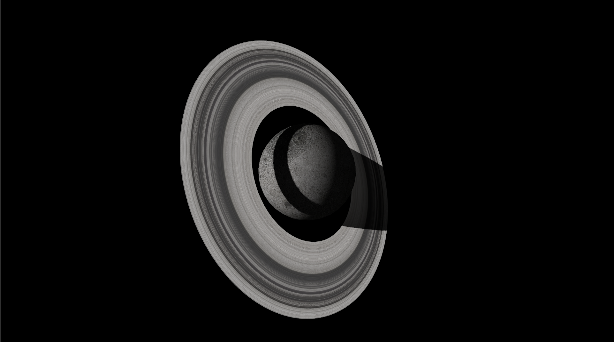

# Moon and rings

This project is a renderer for an object and a particle system using Vulkan.



The rings are a particle system orbiting around the center of the moon.

## Installation

### Dependencies

- The Vulkan SDK
- glm for matrix operations
- GLFW for window and event management
- tiny_obj_loader for loading .obj
- stb_image for loading textures
- gcc (g++) for compilation
- glslangValidator to compile shaders to SPIR-V

### Compilation

- ```make``` will compile the shaders and the program
- ```make shader``` will only compile the shaders
- ```make debug``` will compile the shader normally and the program in debug mode

## In the program

To move the camera you (will be able to) use WASD keys to move around and the spacebar/X to go up and down.